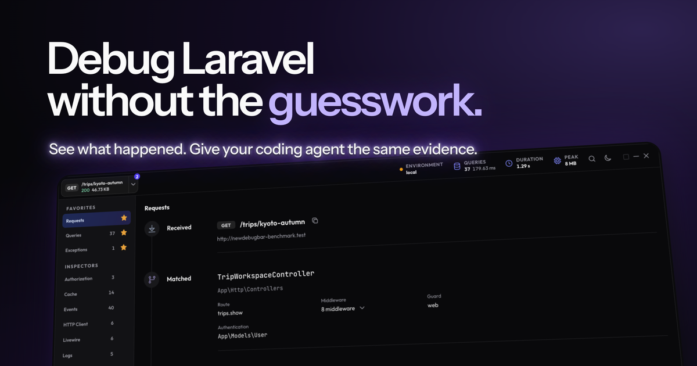

# The New Debug Bar for Laravel

The New Debug Bar is a modern debugging tool for Laravel, built for developers and coding agents. It helps you understand each request and find problems without cluttering your local app.

It includes first-class support for AI coding agents through its local MCP server, giving agents exact debug data instead of making them guess from a web page.

## Documentation

Everything you need to install and use The New Debug Bar is available in the [official documentation](https://newdebugbar.com/docs).

## Why I built The New Debug Bar

I'm [Benjamin Crozat](https://x.com/benjamincrozat), and I built The New Debug Bar because I wanted a debug bar that looks modern and is pleasant to use every day. Its clearer interface, favorite sections, and command palette make everyday debugging more convenient. Built-in MCP support gives coding agents direct access to focused debug data, making them faster and easier to work with.

## Sponsor The New Debug Bar

The New Debug Bar is a free and open source project. Sponsoring it helps me spend more time improving the package and serving the Laravel community.

If The New Debug Bar helps you or your business relies on Laravel, you can [sponsor the project on GitHub](https://github.com/sponsors/benjamincrozat). You can also support its development by [hiring me as a freelance Laravel developer](https://benjamincrozat.com).
